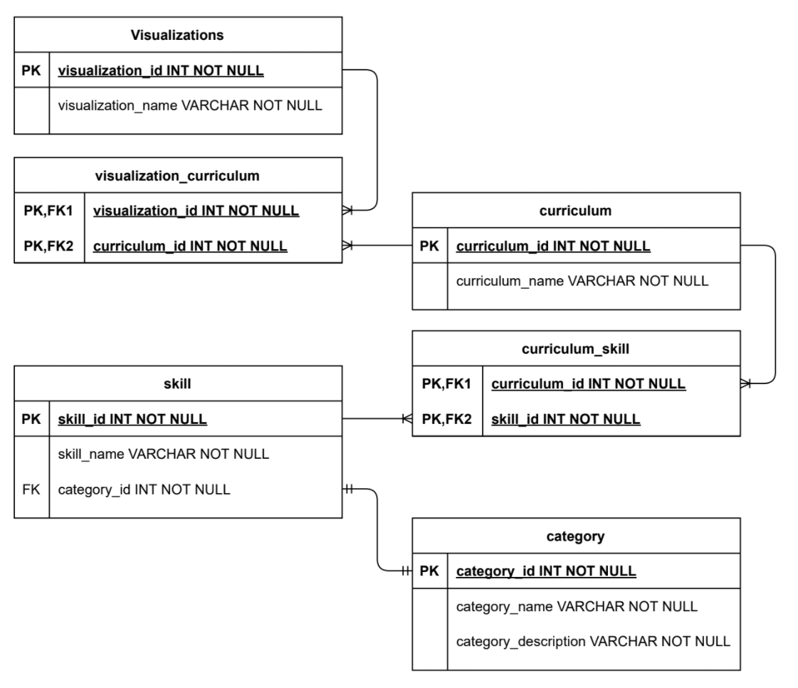

# Curricula Visualization Tool

[Go to Visualization Tool server code repo](https://github.com/bach-tran-batch-1006/visualization-tool-server)

[Go to Visualization Tool client code repo](https://github.com/bach-tran-batch-1006/visualization-tool-client)

## Table of Contents
* [Overview](#Overview)
    - [Project Description](#Description)
* [Front End Application](#Front-End-Application)
    - [View Page](#View-Page)
    - [Edit Pages](#Edit-Pages)
        - [Edit Skills and Categories](#Edit-Skills-and-Categories)

# Overview

## Description
The Curricula Visualization Tool is used, at a high-level, to provide a color-coded visualization for Revature Sales Representatives to showcase the various skills a certain curriculum (i.e. a batch) has learned through the course of their Revature Training Program. Each visualization is representative of various curricula and the skills they are familiar with. Each skill belongs to a category. Obviously, keeping track of which technologies each curriculum has been trained on can be a daunting task -  that is why we have provided the ability to dynamically add, remove, and edit different skills, categories, and curricula to fit the needs suited at any point in time.

## Technologies Used
- Spring Boot
- Hibernate
- Angular
- Junit
- Selenium
- Maven
- H2 database
- Logback

## Features
- Displays Curriculum in orgonized tabs
- Skills highlight if they were added to a certain curriculum


# Front End Application

## View Page
include screenshot maybe

## Edit Pages

### Edit Skills and Categories
include screenshot here

talk about each of the buttons on the page and their function


### Edit Curricula
include screenshot here

talk about each of the buttons on the page and their function

### Edit Visualizations
include screenshot here

talk about each of the buttons on the page and their function

## Testing
Talk about Jasmine and Protractor


---
# Back End API

## Sample Output
### Visualization Object
```json
{
    "visualizationId": 1,
    "visualizationName": "First Visualization",
    "curriculumList": [
        {
        "curriculumId": 1,
            "curriculumName": "Java with Automation",
            "skillList": [
                {
                    "skillId": 33,
                    "skillName": "Angular",
                    "category": {
                        "categoryId": 33,
                        "categoryName": "Client-Side Technologies",
                        "categoryDescription": "Tools developers can leverage to build front-end web applications"
                    }
                }
            ]
        }
    ]
}
```
### Curriculum Object
```JSON
{
    "curriculumId": 1,
    "curriculumName": "Java with Automation",
    "skillList": [
        {
            "skillId": 33,
            "skillName": "Angular",
            "category": {
                "categoryId": 33,
                "categoryName": "Client-Side Technologies",
                "categoryDescription": "Tools developers can leverage to build front-end web applications"
            }
        }
    ]
}
```

### Skill Object
```JSON
{
    "skillId": 33,
    "skillName": "Angular",
    "category": {
        "categoryId": 33,
        "categoryName": "Client-Side Technologies",
        "categoryDescription": "Tools developers can leverage to build front-end web applications"
    }
}
```

### Category Object
```JSON
{
    "categoryId": 2,
    "categoryName": "Language",
    "categoryDescription": "Programming Languages"
}
```

## Endpoints

## `/visualization`
**Verb:** GET

**Response Format:** application/json

**Status Codes:**
- 200: OK

**Response:** Array of all visualization objects stored in the database. If the database is empty, it just returns an empty array.


## `/visualization/{id}`
**Verb:** GET

**Response Format:** application/json

**Status Codes:**
- 200: OK
- 400: Non-integer/Empty ID
- 404: No visualization found for given ID

**Response:** Returns a visualization object specified by the ID. If the ID is not found, it will return a 404 error and if the user provides an unparsable ID, it will return a 400 error.


## `/visualization`
**Verb:** POST

**Input Format:** application/json (automatically formatted by front end application)

**Response Format:** application/json

**Status Codes:**
- 200: OK
- 400: Empty Name given for the new visualization

**Response:** Adds a new visualization object to the database and returns the created visualization. If the user sends information to create the new visualization but leaves the name blank, it will return a 400 error.


## `/visualization/{id}`
**Verb:** PUT

**Input Format:** application/json (automatically formatted by front end application)

**Response Format:** application/json

**Status Codes:**
- 200: OK
- 400: Non-integer/Empty ID, Empty Name given for the updated visualization
- 404: No visualization found for given ID

**Response:** Updates a visualization object already stored in the database and returns the updated visualization. If the user sends information to update the visualization but leaves the name blank, it will return a 400 error. If the ID is not found, it will return a 404 error and if the user provides an unparsable ID, it will return a 400 error.


## `/visualization/{id}`
**Verb:** DELETE

**Response Format:** int

**Status Codes:**
- 200: OK
- 400: Non-integer/Empty ID
- 404: No visualization found for given ID

**Response:** Deletes a visualization from the database with the ID provided by the user and returns the ID of the deleted visualization upon success. If the ID is not found, it will return a 404 error and if the user provides an unparsable ID, it will return a 400 error.


## `/visualization/{id}/skills`
**Verb:** GET

**Response Format:** application/json

**Status Codes:**
- 200: OK
- 400: Non-integer/Empty ID
- 404: No visualization found for given ID

**Response:** Returns list of all the unique skills held by the visualization specified by the ID provided by the user. If the ID is not found, it will return a 404 error and if the user provides an unparsable ID, it will return a 400 error.


## `/visualization/{id}/categories`
**Verb:** GET

**Response Format:** application/json

**Status Codes:**
- 200: OK
- 400: Non-integer/Empty ID
- 404: No visualization found for given ID

**Response:** Returns list of all the unique categories held by the visualization specified by the ID provided by the user. If the ID is not found, it will return a 404 error and if the user provides an unparsable ID, it will return a 400 error.


## `/curriculum`
**Verb:** GET

**Response Format:** application/json

**Status Codes:**
- 200: OK

**Response:** Array of all curriculum objects stored in the database. If the database is empty, it just returns an empty array.


## `/curriculum/{id}`
**Verb:** GET

**Response Format:** application/json

**Status Codes:**
- 200: OK
- 400: Non-integer/Empty ID
- 404: No curriculum found for given ID

**Response:** Returns a curriculum object specified by the ID. If the ID is not found, it will return a 404 error and if the user provides an unparsable ID, it will return a 400 error.


## `/curriculum`
**Verb:** POST

**Input Format:** application/json (automatically formatted by front end application)

**Response Format:** application/json

**Status Codes:**
- 200: OK
- 400: Empty Name given for the new curriculum

**Response:** Adds a new curriculum object to the database and returns the created curriculum. If the user sends information to create the new curriculum but leaves the name blank, it will return a 400 error.


## `/curriculum/{id}`
**Verb:** PUT

**Input Format:** application/json (automatically formatted by front end application)

**Response Format:** application/json

**Status Codes:**
- 200: OK
- 400: Non-integer/Empty ID, Empty Name given for the updated curriculum
- 404: No curriculum found for given ID

**Response:** Updates a curriculum object already stored in the database and returns the updated curriculum. If the user sends information to update the curriculum but leaves the name blank, it will return a 400 error. If the ID is not found, it will return a 404 error and if the user provides an unparsable ID, it will return a 400 error.


## `/curriculum/{id}`
**Verb:** DELETE

**Response Format:** int

**Status Codes:**
- 200: OK
- 400: Non-integer/Empty ID, Visualization Depends on curriculum
- 404: No curriculum found for given ID

**Response:** Deletes a curriculum from the database with the ID provided by the user and returns the ID of the deleted curriculum upon success. If the ID is not found, it will return a 404 error and if the user provides an unparsable ID, it will return a 400 error. If the ID provided by the user is a curriculum that exists within a visualization, it halts the deletion and returns a 400 error.


## `/curriculum/{id}/categories`
**Verb:** GET

**Response Format:** application/json

**Status Codes:**
- 200: OK
- 400: Non-integer/Empty ID
- 404: No curriculum found for given ID

**Response:** Returns list of all the unique categories held by the curriculum specified by the ID provided by the user. If the ID is not found, it will return a 404 error and if the user provides an unparsable ID, it will return a 400 error.


## `/skill`
**Verb:** GET

**Response Format:** application/json

**Status Codes:**
- 200: OK

**Response:** Array of all skill objects stored in the database. If the database is empty, it just returns an empty array.


## `/skill/{id}`
**Verb:** GET

**Response Format:** application/json

**Status Codes:**
- 200: OK
- 400: Non-integer/Empty ID
- 404: No skill found for given ID

**Response:** Returns a skill object specified by the ID. If the ID is not found, it will return a 404 error and if the user provides an unparsable ID, it will return a 400 error.


## `/skill`
**Verb:** POST

**Input Format:** application/json (automatically formatted by front end application)

**Response Format:** application/json

**Status Codes:**
- 200: OK
- 400: Empty Name given for the new skill

**Response:** Adds a new skill object to the database and returns the created skill. If the user sends information to create the new skill but leaves the name blank, it will return a 400 error.


## `/skill/{id}`
**Verb:** PUT

**Input Format:** application/json (automatically formatted by front end application)

**Response Format:** application/json

**Status Codes:**
- 200: OK
- 400: Non-integer/Empty ID, Empty Name given for the updated skill
- 404: No skill found for given ID

**Response:** Updates a skill object already stored in the database and returns the updated skill. If the user sends information to update the skill but leaves the name blank, it will return a 400 error. If the ID is not found, it will return a 404 error and if the user provides an unparsable ID, it will return a 400 error.


## `/skill/{id}`
**Verb:** DELETE

**Response Format:** int

**Status Codes:**
- 200: OK
- 400: Non-integer/Empty ID, Visualization Depends on skill
- 404: No skill found for given ID

**Response:** Deletes a skill from the database with the ID provided by the user and returns the ID of the deleted skill upon success. If the ID is not found, it will return a 404 error and if the user provides an unparsable ID, it will return a 400 error. If the ID provided by the user is a skill that exists within a curriculum, it halts the deletion and returns a 400 error.

---
## `/category`
**Verb:** GET

**Response Format:** application/json

**Status Codes:**
- 200: OK

**Response:** Array of all category objects stored in the database. If the database is empty, it just returns an empty array.


## `/category`
**Verb:** POST

**Input Format:** application/json (automatically formatted by front end application)

**Response Format:** application/json

**Status Codes:**
- 200: OK
- 400: Empty Name given for the new category

**Response:** Adds a new category object to the database and returns the created category. If the user sends information to create the new category but leaves the name blank, it will return a 400 error.


## `/category/{id}`
**Verb:** PUT

**Input Format:** application/json (automatically formatted by front end application)

**Response Format:** application/json

**Status Codes:**
- 200: OK
- 400: Non-integer/Empty ID, Empty Name given for the updated category
- 404: No category found for given ID

**Response:** Updates a category object already stored in the database and returns the updated category. If the user sends information to update the category but leaves the name blank, it will return a 400 error. If the ID is not found, it will return a 404 error and if the user provides an unparsable ID, it will return a 400 error.


## `/category/{id}`
**Verb:** DELETE

**Response Format:** int

**Status Codes:**
- 200: OK
- 400: Non-integer/Empty ID, Visualization Depends on category
- 404: No category found for given ID

**Response:** Deletes a category from the database with the ID provided by the user and returns the ID of the deleted category upon success. If the ID is not found, it will return a 404 error and if the user provides an unparsable ID, it will return a 400 error. If the ID provided by the user is a category that exists within a skill, it halts the deletion and returns a 400 error.


## Models
List the models for hibernate

## Controller Layer
Talk about endpoint handling and logging

## Service Layer
Talk about general error checking

## Dao Layer

Talk about Spring Data JPA

## Testing
Talk about JUnit and Mockito


